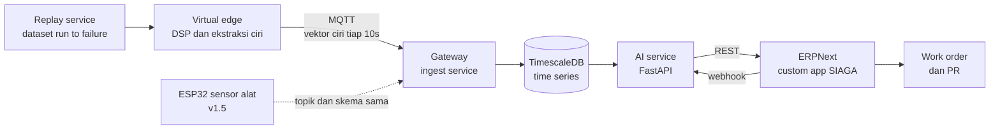
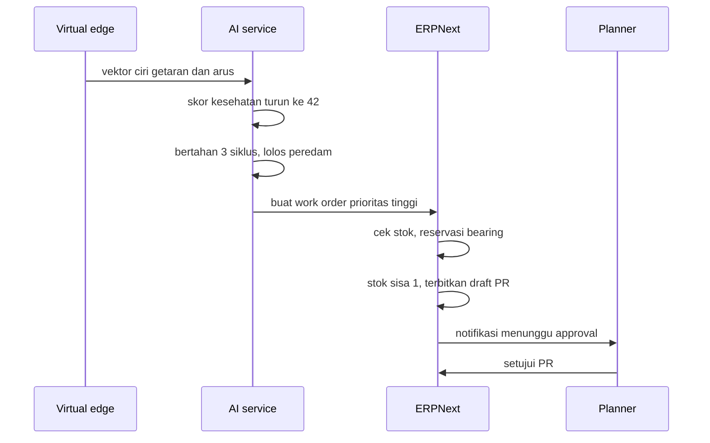

# PRD SIAGA — ERP Maintenance & Asset Management Tambang

2026-09-18 · @Someone

## Ringkasan produk

SIAGA membuat work order maintenance dari kondisi alat yang terukur, bukan dari jadwal kalender. Sistem membaca arus, getaran, dan suhu alat lewat sensor, mengekstraksi ciri sinyal langsung di perangkat, mendeteksi degradasi komponen, lalu menerbitkan work order, mengunci spare part, dan menyiapkan draft purchase requisition secara otomatis. Manusia hanya masuk di titik approval.

Produk ini dibangun sebagai custom app di atas ERPNext, dengan layer IoT dan layer AI sebagai service terpisah. Target penggunanya adalah maintenance planner dan warehouse di site tambang skala menengah yang alat beratnya kritis tapi belum punya sistem condition based maintenance.

Pembedanya ada pada rantai yang utuh dari sensor sampai dokumen procurement. ERP komersial berhenti di work order manual, sedangkan platform IoT berhenti di dashboard. SIAGA menyambung keduanya dalam satu alur yang bisa dijalankan ulang siapa pun dengan satu perintah.

Versi pertama dibangun tanpa hardware. Sumber getaran diambil dari dataset run to failure publik yang diputar ulang sebagai aliran waktu nyata, bukan dari sensor terpasang. Perangkat ESP32 masuk di v1.5 lewat antarmuka yang sama persis, dan alasan urutan ini ada di bagian sumber data.

## Masalah dan latar belakang

Di operasi tambang, biaya terbesar yang bisa dikendalikan bukan di akuntansi melainkan di ketersediaan alat. Satu unit berhenti tidak terencana berarti kehilangan ritase seharian, dan spare part penggantinya sering butuh berminggu-minggu karena site jauh dari gudang pusat.

Empat masalah yang jadi sasaran sistem ini:

1. Maintenance masih berbasis jam operasi atau kalender, sehingga komponen sehat ikut diganti dan komponen yang sudah rusak lolos sampai gagal.
2. Data kondisi alat berhenti di dashboard monitoring dan tidak pernah berubah jadi tindakan di sistem kerja.
3. Forecast spare part disusun dari konsumsi historis, jadi selalu terlambat merespons kondisi alat saat ini.
4. Jeda antara deteksi masalah dan terbitnya purchase requisition diisi proses manual lewat WhatsApp, kertas, dan spreadsheet.

Semua ini adalah masalah integrasi, bukan masalah algoritma. Karena itu nilai sistem terletak pada sambungan antar langkah, bukan pada akurasi model semata.

## Tujuan dan non-tujuan

Tujuan v1 adalah satu rantai otomasi yang jalan penuh untuk satu kelas alat, bukan ERP lengkap, dan seluruhnya berupa perangkat lunak. Kelas alat yang dipilih adalah pompa dewatering bermotor listrik, karena degradasi bearingnya punya pola yang jelas dan tersedia dataset run to failure publik untuk kelas mesin serupa.

Tujuan yang harus tercapai:

- Aliran data kondisi dari minimal dua unit alat masuk ke sistem secara kontinu dan tersimpan sebagai riwayat, lewat antarmuka yang nanti dipakai sensor fisik tanpa perubahan.
- Model prediksi menghasilkan skor kesehatan dan proyeksi waktu menuju ambang, lengkap dengan alasan yang bisa ditelusuri dan tingkat keyakinan.
- Work order terbit otomatis ketika skor melewati ambang, lengkap dengan prioritas dan daftar part yang dibutuhkan.
- Stok spare part tercek dan terkunci otomatis, dan draft purchase requisition terbit jika stok di bawah titik pesan ulang.
- Seluruh rantai bisa didemokan dari satu perintah di mesin bersih, dalam satu sesi tanpa intervensi manual.

Non-tujuan yang sengaja dibuang dari v1:

- Modul akuntansi, payroll, penggajian, dan pajak. ERPNext sudah punya dan tidak perlu disentuh.
- Multi site, multi company, dan multi currency.
- Aplikasi mobile native. Antarmuka lapangan cukup web responsif.
- Integrasi ke sistem eksternal seperti fleet management atau weighbridge.
- Pemantauan kondisi untuk lebih dari satu kelas alat. Registry tetap menerima kelas apa pun, tapi profil pemantauan hanya dibuat untuk satu kelas. Kelas kedua baru dipertimbangkan setelah kelas pertama benar-benar selesai.
- Hardware fisik. ESP32 dan sensor ditunda ke v1.5, dan v1 dirancang supaya penambahannya tidak menyentuh apa pun di atas lapisan edge.

## Pengguna dan peran

Lima peran memakai sistem ini, dengan hak akses berbeda di ERPNext.

| Peran | Yang dilakukan di sistem | Hak akses |
| --- | --- | --- |
| Maintenance planner | Mendaftarkan aset, meninjau work order otomatis, mengatur prioritas dan jadwal | Buat dan ubah aset, baca dan ubah work order, baca data kondisi |
| Mekanik | Menerima work order, mengisi hasil perbaikan dan part terpakai | Ubah work order yang ditugaskan |
| Warehouse | Mengonfirmasi ketersediaan dan mengeluarkan spare part | Ubah stok dan reservasi |
| Procurement | Meninjau dan menyetujui purchase requisition | Setujui PR dan PO |
| Maintenance manager | Memantau kesehatan armada dan biaya maintenance | Baca semua, setujui work order berbiaya besar |

Peran yang paling menentukan keberhasilan adalah planner. Kalau work order otomatis terlalu sering keliru, planner akan berhenti mempercayainya dan kembali bekerja manual. Karena itu setiap work order otomatis wajib menampilkan alasan pemicunya dan tingkat keyakinan model.

## Arsitektur sistem

Tiga layer dengan batas tegas: edge mengirim data, AI service memutuskan, ERPNext mencatat dan menjalankan. Pemisahan ini disengaja supaya AI service bisa diganti atau diuji tanpa menyentuh ERP.

Sumber data mengirim vektor ciri lewat MQTT ke gateway, gateway menormalkan dan menyimpannya sebagai time series. AI service membaca jendela data terakhir, menghitung skor kesehatan, lalu memanggil REST API ERPNext untuk menerbitkan dokumen. ERPNext mengirim webhook balik ketika work order selesai, dan hasil perbaikan itu jadi label untuk melatih ulang model.

Keputusan penting ada di arah panggilan. AI service yang memanggil ERPNext, bukan sebaliknya, supaya ERP tidak pernah menunggu inferensi dan tetap responsif saat model lambat atau mati.

### Sumber data v1

V1 tidak memakai sensor. Sumber getarannya adalah dataset run to failure publik, terutama kumpulan IMS dari NASA Prognostics Data Repository: empat bearing pada satu poros 2000 RPM, direkam pada 20 kHz dalam cuplikan satu detik tiap sepuluh menit, dijalankan terus sampai bearing benar benar rusak dalam rentang beberapa hari sampai lima minggu. Dataset CWRU dipakai sebagai pelengkap untuk variasi jenis cacat pada beberapa tingkat keparahan.

Pilihan ini memberi sesuatu yang justru tidak bisa dihasilkan rig uji delapan minggu: degradasi bearing sungguhan dari sehat sampai gagal, lengkap dengan titik akhir yang tercatat. Tanpa itu, proyeksi tren tidak punya apa pun untuk diuji kebenarannya, dan data baseline kondisi sehat harus dikumpulkan berminggu minggu sebelum model bisa dilatih.

Replay service membacakan dataset sebagai aliran waktu nyata, dengan kendali kecepatan supaya lima minggu degradasi bisa diputar dalam lima menit saat demo, atau pada kecepatan asli saat pengujian. Yang keluar dari replay service adalah gelombang mentah, bukan ciri jadi, karena tahap ekstraksi ciri justru bagian yang harus ikut diuji.

### Pengolahan sinyal di edge

Getaran tidak pernah masuk ke sistem dalam bentuk mentah. Kerusakan mekanis muncul sebagai energi di pita frekuensi tertentu, dan mengalirkan gelombang penuh terus menerus tidak masuk akal, baik untuk ESP32 nanti maupun untuk biaya penyimpanan sekarang.

Virtual edge menurunkan cuplikan ke 3.2 kHz, mengambil jendela 1024 titik, menghitung FFT, lalu menerbitkan vektor ciri tiap 10 detik. Isinya sekitar 25 angka: RMS per pita frekuensi, amplitudo pada 1x, 2x, dan 3x putaran poros, kurtosis, crest factor, RMS arus, dan suhu. Bandwidth turun ribuan kali lipat, dan model bekerja di atas fitur yang sudah punya arti fisik sehingga penjelasan pemicu jadi mungkin.

Penurunan ke 3.2 kHz bukan kompromi yang merusak fisikanya. Frekuensi cacat bearing pada dataset IMS ada di sekitar 236 Hz untuk outer race dan 297 Hz untuk inner race, jauh di bawah batas Nyquist 1.6 kHz. Model yang dilatih sekarang tetap sahih ketika sumbernya diganti perangkat fisik, karena melihat pita frekuensi yang sama.

Gelombang mentah tetap disimpan sesekali, satu burst dua detik tiap jam, sebagai bukti dan bahan analisis ulang kalau definisi ciri perlu diubah.

Satu batas dinyatakan terbuka sejak awal. Kerusakan bearing tahap paling dini butuh envelope analysis di atas 10 kHz dengan sensor IEPE, dan itu di luar jangkauan ESP32 yang jadi target v1.5. Sistem ini menangkap kerusakan yang sudah berkembang, ketidakseimbangan, misalignment, dan kelonggaran dudukan.

### Kontrak antarmuka ke hardware

Supaya penambahan hardware di v1.5 tidak berubah jadi penulisan ulang, tiga hal dikunci sejak sekarang dan diperlakukan sebagai kontrak.

Topik dan skema pesan MQTT. Replay service menerbitkan ke topik yang nanti dipakai ESP32, dengan skema vektor ciri yang diberi nomor versi. Gateway tidak pernah tahu siapa penerbitnya, sehingga mengganti sumber berarti mematikan satu proses lalu menyalakan perangkat.

Laju cuplik 3.2 kHz dan definisi 25 ciri. Angka ini diambil dari batas ESP32 dan ADXL345, bukan dari kenyamanan simulasi, supaya tidak ada ciri yang ternyata mustahil dihitung di perangkat.

Implementasi DSP sebagai rujukan. Versi Python di virtual edge jadi oracle saat porting ke C++ dengan ESP-DSP: gelombang uji yang sama harus menghasilkan vektor ciri yang sama dalam toleransi yang ditetapkan. Ini mengubah porting firmware dari pekerjaan menebak jadi pekerjaan yang punya kriteria lulus.

## Lingkup modul dan fitur

P0 wajib selesai, P1 dikerjakan jika waktu cukup, P2 hanya dibangun kalau P0 dan P1 sudah stabil.

| Modul | Fitur | Prioritas |
| --- | --- | --- |
| Sumber data | Replay service, putar dataset run to failure jadi aliran waktu nyata dengan kendali kecepatan | P0 |
| Sumber data | Virtual edge, DSP 3.2 kHz dan ekstraksi 25 ciri tiap 10 detik | P0 |
| Sumber data | Injeksi gangguan sintetis di atas baseline sehat untuk uji terkendali | P1 |
| Sumber data | Firmware ESP32 dengan DSP hasil porting, menerbitkan ke topik yang sama | v1.5 |
| Sumber data | Buffer lokal saat koneksi putus, kirim ulang saat tersambung | v1.5 |
| Asset registry | Master alat, komponen, dan riwayat penggantian part | P0 |
| Asset registry | Asset Class sebagai konfigurasi, kelas baru tanpa menulis kode | P0 |
| Asset registry | Pendaftaran aset mandiri lewat UI, termasuk pemasangan sumber datanya | P0 |
| Asset registry | Masa belajar baseline dan pelatihan model per unit secara otomatis | P1 |
| Condition monitoring | Grafik tren per parameter dan skor kesehatan terkini | P0 |
| Prediksi | Deteksi anomali dan proyeksi waktu menuju ambang | P0 |
| Prediksi | Penjelasan pemicu, parameter mana yang menyimpang dan sejauh apa | P0 |
| Prediksi | Gating kondisi operasi, skor hanya dihitung saat alat berjalan stabil | P0 |
| Work order | Terbit otomatis dari ambang skor, dengan prioritas dan daftar part | P0 |
| Work order | Peredam duplikasi, histeresis ambang dan satu WO terbuka per komponen | P0 |
| Work order | Penutupan oleh mekanik, hasil jadi label pelatihan ulang | P1 |
| Spare part | Cek stok, reservasi otomatis, titik pesan ulang dinamis | P0 |
| Procurement | Draft purchase requisition otomatis, menunggu approval | P0 |
| Procurement | Three way matching PO, penerimaan barang, dan invoice | P2 |
| Forecast | Proyeksi kebutuhan part dari prediksi kegagalan, bukan konsumsi historis | P1 |
| Dokumen AI | Ekstraksi invoice vendor jadi draft transaksi | P2 |
| Agen kueri | Tanya jawab bahasa alami ke data maintenance, akses baca saja | P2 |

Agen kueri sengaja ditaruh paling akhir. Demo chatbot ke database sudah umum dan paling mudah dipatahkan penilai, sedangkan rantai otomasi P0 jauh lebih sulit ditiru.

## Alur otomasi end to end

Ini alur inti yang jadi demo utama project. Tujuh langkah, dan hanya satu yang butuh manusia.

1. Virtual edge menerbitkan vektor ciri getaran dan arus motor pompa tiap 10 detik, hasil pemrosesan gelombang dari dataset yang sedang diputar.
2. AI service membaca jendela 24 jam terakhir dan mendeteksi kenaikan energi getaran di pita frekuensi cacat bearing, sementara RMS arus dan suhu ikut merangkak naik.
3. Skor kesehatan turun melewati ambang dan bertahan di bawahnya selama tiga siklus inferensi berturut turut. Sistem menerbitkan work order prioritas tinggi dengan proyeksi menyentuh ambang kritis dalam 12 hari, disertai interval keyakinan.
4. Work order membawa daftar part yang kemungkinan besar dibutuhkan, diambil dari riwayat perbaikan gejala serupa.
5. Sistem mengecek stok, mereservasi satu bearing, dan mencatat sisa stok gudang.
6. Sisa stok jatuh di bawah titik pesan ulang, draft purchase requisition terbit otomatis ke antrean procurement.
7. Planner meninjau dan menyetujui. Ini satu-satunya titik manusia dalam alur.

Tiga aturan menjaga alur ini tidak membanjiri planner, dan tanpanya satu kerusakan bisa menerbitkan ratusan dokumen karena anomali bertahan berjam jam. Work order baru hanya terbit kalau skor bertahan di bawah ambang selama tiga siklus berturut turut. Hanya boleh ada satu work order terbuka per pasangan aset dan komponen. Ambang memakai histeresis, memicu di bawah 40 dan baru dianggap pulih di atas 55, supaya skor yang bergetar di sekitar ambang tidak menerbitkan dokumen berulang.

Setelah perbaikan selesai, mekanik menutup work order dan mencatat apa yang sebenarnya rusak. Catatan itu masuk kembali sebagai label untuk pelatihan ulang model, sehingga sistem membaik seiring pemakaian.

## Model data

Entitas baru dibuat sebagai DocType di custom app SIAGA. Entitas yang sudah ada di ERPNext dipakai apa adanya dan hanya ditambah field, jangan dibuat ulang.

| Entitas | Status | Field penting |
| --- | --- | --- |
| Asset Class | Baru | Nama kelas, RPM nominal, pengali frekuensi cacat bearing, versi skema ciri, ambang pemicu dan pemulihan, daftar part kandidat |
| Asset | Bawaan ERPNext | Tambah field kelas alat, lokasi site, jam operasi |
| Asset Monitoring Profile | Baru | Id asset, sumber data, status pemantauan, periode baseline, versi model terlatih |
| Asset Component | Baru | Induk asset, jenis komponen, tanggal pasang, umur desain |
| Sensor Reading | Baru, di TimescaleDB | Waktu, id asset, nama ciri, nilai, versi skema |
| Health Score | Baru | Id asset, waktu, skor, proyeksi hari ke ambang, pemicu, keyakinan model |
| SIAGA Work Order | Baru | Sumber pemicu, id health score, part terduga, prioritas, status |
| Part Reservation | Baru | Id work order, item, gudang, jumlah, status pelepasan |
| Asset Operating State | Baru | Id asset, waktu, status mati, start, stabil, atau berbeban |
| Failure Log | Baru | Id work order, komponen yang rusak, akar masalah, label pelatihan |
| Item Reorder | Bawaan ERPNext | Titik pesan ulang per gudang, diperbarui dari hasil forecast |
| Material Request | Bawaan ERPNext | Tambah penanda dibuat otomatis oleh SIAGA |

Relasi utamanya lurus. Satu asset punya banyak komponen, satu komponen punya banyak pembacaan sensor dan skor kesehatan. Satu skor kesehatan bisa memicu satu work order, dan satu work order menghasilkan satu failure log yang jadi bahan pelatihan berikutnya.

Sensor Reading sengaja tidak disimpan di MariaDB milik ERPNext. Volume datanya terlalu besar dan pola kuerinya berbeda, jadi dipisah ke TimescaleDB dan dirujuk lewat id asset.

Work order maintenance dibuat sebagai DocType sendiri, bukan memperluas yang bawaan. Work Order di ERPNext adalah dokumen manufaktur yang terikat ke BOM, operasi, dan workstation, dan memakainya untuk maintenance akan menyeret seluruh rantai produksi yang tidak relevan. Sebaliknya doctype maintenance bawaan seperti Asset Maintenance Log justru berbasis jadwal, persis pendekatan yang ingin diganti sistem ini. DocType sendiri lebih bersih dan tetap merujuk Asset dan Item bawaan.

Reservasi spare part juga dibangun sendiri dengan alasan serupa. Stock Reservation Entry di v15 terikat ke Sales Order dan tidak bisa dipakai apa adanya untuk work order maintenance. Yang justru bisa dipakai ulang adalah mesin reorder bawaan: titik pesan ulang tinggal di child table Item Reorder, dan scheduler reorder_item sudah sanggup menerbitkan Material Request otomatis, sehingga langkah keenam alur tidak perlu ditulis dari nol.

## Menambah aset baru

Menambah alat adalah pekerjaan pengguna, bukan pekerjaan pengembang. Planner membuka menu Asset, mengisi form, memilih kelasnya, lalu menyimpan. Tidak ada tabel yang dibuat, tidak ada kolom yang ditambah, tidak ada deployment ulang. Yang bertambah hanya baris. Kalau menambah alat baru sampai menuntut perubahan struktur data, rancangannya salah sejak awal.

Yang tidak ikut otomatis adalah pemantauan kondisi. Terdaftar tidak sama dengan terpantau, dan pembedanya ada di Asset Class.

Asset Class memegang segala sesuatu yang terikat jenis mesin: RPM nominal, geometri bearing yang menentukan frekuensi cacat, versi skema ciri, ambang pemicu dan pemulihan, serta daftar part kandidat per gejala. Aset yang kelasnya punya profil pemantauan aktif masuk ke rantai tujuh langkah. Aset yang kelasnya belum punya tetap tercatat penuh dan tetap mendapat riwayat maintenance, work order manual, reservasi part, dan pembelian, hanya tanpa skor kesehatan otomatis.

Perilaku menurun dengan anggun ini disengaja. Site yang mendaftarkan tiga truk hari ini tetap memetik manfaat dari sisi registry dan procurement, sementara pemantauan kondisi untuk kelas truk menunggu model dan sumber datanya siap. Truk adalah mesin diesel beroda yang mode kegagalannya ada di engine, transmisi, hidrolik, dan rem, datanya lazim diambil dari CAN bus alih alih sensor getaran tempel, dan karena bergerak ia tidak punya listrik maupun jaringan tetap. Menolak aset yang belum didukung jauh lebih buruk daripada menerimanya tanpa pemantauan.

Aset yang baru terdaftar juga tidak bisa langsung dinilai, karena model anomali butuh contoh kondisi sehat dari unit itu sendiri. Setelah sumber datanya dipasang, aset masuk status mengumpulkan baseline selama periode yang ditentukan kelasnya, model per unit dilatih, lalu statusnya berubah jadi dipantau. Status pemantauan punya empat nilai: belum terdaftar, mengumpulkan baseline, dipantau, dan ditangguhkan.

Model dilatih per unit, bukan per kelas. Dua pompa bertipe sama tetap punya baseline getaran yang berbeda karena dudukan, beban, dan kualitas pemasangannya berbeda. Satu model yang dipaksa mencakup keduanya akan menganggap unit paling berisik sebagai anomali permanen, dan tidak akan pernah memicu apa pun pada unit paling halus. Jadi definisi ciri dan pipeline milik kelas, sedangkan model anomali milik masing-masing unit.

## Tech stack dan keputusan teknis

| Layer | Pilihan | Alasan |
| --- | --- | --- |
| ERP core | ERPNext v15 di atas Frappe | Python, open source, modul asset dan stock sudah matang, dikenali recruiter |
| Custom app | Frappe app bernama siaga | Terpisah dari core supaya bisa dipasang ulang dan di-push ke GitHub sebagai karya sendiri |
| AI service | FastAPI, scikit-learn, opsional PyTorch | Dimiliki penuh, bisa diuji terpisah, jadi bahan cerita utama saat interview |
| Time series | TimescaleDB | Ekstensi PostgreSQL, kueri jendela waktu cepat tanpa infrastruktur baru |
| Messaging | Mosquitto MQTT | Standar de facto industri, ringan untuk ESP32 |
| Sumber data v1 | Replay service dan virtual edge, Python dan numpy | Dataset run to failure diputar jadi aliran waktu nyata, DSP identik dengan yang nanti ditanam di perangkat |
| Edge v1.5 | ESP32, akselerometer ADXL345, CT sensor arus, DS18B20 | ADXL345 sanggup 3.2 kHz, cukup untuk pita cacat bearing. MPU6050 tidak dipakai karena bandwidth hanya 260 Hz |
| Deployment | Docker Compose | Satu perintah untuk menghidupkan seluruh stack, penting agar reviewer bisa mencoba |

Menunda hardware adalah keputusan penjadwalan, bukan pengurangan lingkup. Pengadaan sensor dan penyetelan rig adalah jalur kritis yang panjang dan tidak mengajarkan apa pun tentang bagian yang membedakan proyek ini, sementara dataset run to failure justru memberi degradasi sungguhan yang tidak bisa dihasilkan rig uji delapan minggu. Hardware masuk setelah rantai perangkat lunaknya terbukti, lewat kontrak antarmuka yang sudah dikunci sejak sekarang.

Keputusan paling berdampak adalah tidak membangun ERP dari nol. Hambatan utama project ini adalah memahami proses bisnis maintenance dan procurement, bukan menulis CRUD. Membangun di atas ERPNext memindahkan waktu ke bagian yang membedakan.

Model prediksi dimulai dari yang sederhana. Isolation Forest di atas vektor ciri, dilatih pada data baseline saat alat sehat, digabung dengan jarak z robust per ciri karena Isolation Forest hampir buta terhadap satu ciri yang melonjak sendirian di tengah dua puluh ciri normal, padahal cacat bearing dini persis seperti itu. Keduanya dikalibrasi ke tepi baseline yang sama dan diambil yang terbesar. Satu model per unit, bukan satu model untuk seluruh kelas, dengan alasan yang dijelaskan di bagian menambah aset baru. Model yang lebih berat baru masuk kalau data riil sudah terkumpul dan baseline terbukti kurang.

Skor anomali hanya dihitung saat alat berjalan stabil. Mencampur kondisi mati, starting, dan berbeban membuat skor tidak bermakna, karena lonjakan arus saat start akan selalu terbaca sebagai anomali. Klasifikasi state sederhana dari RMS arus mendahului setiap inferensi, dan state itu ikut disimpan supaya skor bisa ditelusuri ke konteks operasinya.

Estimasi sisa umur sengaja tidak dibuat sebagai model regresi. Regresi sisa umur menuntut data run to failure, dan proyek ini tidak akan memilikinya. Yang dipakai adalah ekstrapolasi tren skor kesehatan ke ambang kritis dengan interval keyakinan, dan disebut apa adanya sebagai proyeksi tren. Mengklaim model RUL terlatih dari segelintir lintasan dataset adalah lubang yang akan langsung ditemukan penilai teknis, dan kerugiannya jauh lebih besar daripada nilai tambahnya.

Beberapa keputusan kecil dikunci sejak awal karena mahal diubah belakangan. AI service memanggil ERPNext sebagai user khusus siaga bot dengan role terbatas, bukan Administrator. Seluruh timestamp disimpan dalam UTC dan ESP32 menyinkronkan jam ke NTP saat boot. Setiap panggilan pembuatan dokumen membawa kunci idempoten supaya percobaan ulang jaringan tidak melahirkan dokumen kembar. AI service punya uji pytest yang jalan di GitHub Actions sejak minggu pertama ia ada.

## Roadmap 8 minggu

Urutannya sengaja menunda AI sampai minggu kelima. Tanpa data dan tanpa alur dokumen yang jalan, model tidak punya tempat untuk bekerja.

Tanpa hardware, jadwal ini tidak punya jalur kritis pengadaan. Tidak ada komponen yang ditunggu, tidak ada rig yang harus dijaga menyala, dan data baseline kondisi sehat tersedia sejak hari pertama karena dataset sudah memuatnya. Kelonggaran itu sebaiknya tidak dipakai menambah fitur, melainkan disimpan sebagai cadangan waktu untuk minggu 6.

| Minggu | Deliverable | Selesai berarti |
| --- | --- | --- |
| 1 | ERPNext jalan di Docker, custom app siaga terpasang | Bisa login dan membuat asset lewat UI |
| 2 | DocType Asset Class, Asset Component, Health Score, Failure Log | Aset baru bisa didaftarkan lewat UI dan langsung terhubung ke kelasnya |
| 3 | Replay service, virtual edge, gateway MQTT, TimescaleDB terisi | Dataset lima minggu terputar penuh dan vektor ciri masuk terus menerus |
| 4 | Alur work order manual, reservasi spare part, grafik tren di UI | Work order dibuat tangan sudah mengunci stok |
| 5 | AI service deteksi anomali per unit, gating kondisi operasi, skor kesehatan | Skor turun mengikuti degradasi sungguhan di dataset dan diam saat alat mati |
| 6 | Otomasi work order, peredam duplikasi, draft purchase requisition | Rantai tujuh langkah jalan tanpa intervensi dan tanpa dokumen kembar |
| 7 | Proyeksi tren ke ambang dan penjelasan pemicu | Setiap work order menampilkan alasan, proyeksi, dan keyakinan |
| 8 | Dokumentasi, README, video demo, deployment sekali perintah | Orang lain bisa menjalankan dan memahaminya |

Minggu 6 adalah titik kritis. Kalau di akhir minggu 6 rantai belum jalan penuh, hentikan penambahan fitur dan pakai dua minggu sisa untuk membuat yang ada benar-benar solid. Demo pendek yang jalan mulus mengalahkan fitur banyak yang setengah jadi.

Minggu 8 jangan dipotong. Dokumentasi dan video demo adalah bagian yang benar-benar dilihat recruiter, karena hampir tidak ada yang akan menjalankan kode di laptopnya sendiri.

## Metrik sukses

Dua jenis metrik, dan yang kedua justru lebih menentukan karena tujuan project ini adalah portofolio.

Metrik teknis:

- Rantai tujuh langkah selesai di bawah 60 detik dari anomali terdeteksi sampai draft PR terbit.
- Deteksi anomali menandai degradasi minimal 12 jam waktu dataset sebelum kegagalan tercatat, dengan target 24 jam. Angka 48 jam yang semula ditulis tidak terbukti pada dataset IMS set 2: pada 3.2 kHz degradasi bearing 1 baru terbaca sekitar 36 jam sebelum akhir, dan pemicu tiga siklus berturut turut jatuh sekitar 24 jam sebelumnya.
- Alarm palsu di bawah 2 per unit per minggu pada data normal, diukur di atas minimal dua minggu baseline.
- Tidak ada work order kembar untuk satu kejadian kerusakan sepanjang pengujian.
- Seluruh stack hidup dari satu perintah docker compose up di mesin bersih.
- Reviewer bisa menjalankan ulang seluruh demo sendiri tanpa perangkat apa pun.

Metrik portofolio:

- Video demo 3 sampai 5 menit yang menunjukkan degradasi bearing sungguhan berujung pada dokumen procurement di ERP.
- README yang menjelaskan keputusan arsitektur, bukan sekadar cara memasang.
- Satu tulisan teknis tentang mengapa forecast berbasis kondisi mengalahkan forecast historis.
- Bisa menjelaskan seluruh alur dalam 2 menit tanpa membuka kode.

## Risiko dan mitigasi

| Risiko | Dampak | Mitigasi |
| --- | --- | --- |
| Scope creep ke modul ERP lain | Project tidak pernah selesai | Daftar non-tujuan dijadikan pagar keras, ide baru masuk backlog bukan sprint |
| Dataset publik tidak cocok dengan kelas alat | Model belajar pola mesin yang berbeda | Pilih dataset bearing pada mesin berputar sekelas, nyatakan asumsinya terbuka, dan jadikan validasi ulang bagian dari v1.5 |
| Belajar Frappe lebih lama dari perkiraan | Roadmap meleset sejak minggu 2 | Alokasikan minggu 1 penuh untuk belajar, potong fitur P1 bukan geser deadline |
| Demo dianggap simulasi belaka | Nilai jual turun, dikira tidak pernah menyentuh data nyata | Pakai dataset run to failure terukur, bukan data sintetis, dan sebut sumbernya terang terangan di README dan video |
| Kontrak antarmuka tidak ditegakkan | Penambahan hardware di v1.5 berubah jadi penulisan ulang | Skema pesan diberi nomor versi, DSP Python jadi oracle uji untuk porting firmware |
| Klaim sisa umur tidak terbukti | Kredibilitas teknis jatuh saat ditanya penilai | Sebut sebagai proyeksi tren dengan interval keyakinan, bukan model RUL terlatih |
| Terlihat sebagai project ERP biasa | Nilai jual hilang | Framing selalu digitalisasi operasi tambang, bukan pembuatan ERP |

Risiko paling nyata adalah yang pertama. ERP punya daya tarik untuk terus ditambah modulnya, dan setiap modul baru terasa masuk akal saat itu juga. Perlakukan daftar non-tujuan sebagai keputusan yang sudah diambil, bukan sebagai saran.

Soal data kerusakan, jangan pura-pura punya data lapangan. Menyebut terang terangan bahwa data berasal dari dataset run to failure publik justru menunjukkan kejujuran metodologi, dan itu nilai plus di mata penilai teknis. Lagipula dataset itu memuat kegagalan bearing sungguhan yang berjalan sampai tuntas, yang secara metodologi lebih kuat daripada gangguan yang dipaksakan di rig uji delapan minggu.

## Backlog di luar scope v1

Ditunda dengan sadar, bukan dilupakan. Menuliskannya di sini membuat ide baru punya tempat pulang selain sprint yang sedang berjalan.

- Hardware v1.5: ESP32 dengan ADXL345 dan CT sensor, firmware hasil porting DSP, satu rig pompa untuk demo fisik.
- Modul fuel management dengan deteksi anomali konsumsi BBM. Ini pain point klasik tambang dan kandidat terkuat untuk v2.
- Three way matching otomatis antara purchase order, penerimaan barang, dan invoice vendor.
- Ekstraksi dokumen vendor jadi draft transaksi dengan skor keyakinan.
- Agen kueri bahasa alami dengan akses baca saja dan guardrail text to SQL.
- Profil pemantauan untuk kelas alat bergerak seperti truk dan excavator, dengan sumber data dari CAN bus dan konektivitas seluler alih alih sensor getaran tempel.
- Optimasi jadwal maintenance armada, menggabungkan beberapa work order agar satu unit hanya sekali turun.
- Dukungan multi site dengan gudang pusat dan gudang site.
- Aplikasi mobile untuk mekanik dengan mode luring.

Kalau v1 selesai dan masih ada tenaga, ambil hardware v1.5 lebih dulu. Rantai perangkat lunaknya sudah terbukti dan kontrak antarmukanya sudah dikunci, jadi yang tersisa hanya menanam DSP ke perangkat dan membuktikan vektor cirinya cocok dengan rujukan Python. Menambahkan perangkat fisik di atas fondasi yang sudah jalan adalah pekerjaan yang jauh lebih kecil daripada membangun keduanya sekaligus, dan hasilnya tetap demo fisik yang utuh.

Setelah itu baru fuel management. Modul itu paling spesifik ke tambang, paling mudah dijelaskan ke orang lapangan, dan memakai ulang seluruh fondasi anomaly detection yang sudah dibangun.
