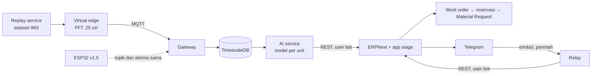

# SIAGA

[](https://github.com/Toni2411/siaga/actions/workflows/tests.yml)

**Maintenance berbasis kondisi yang berujung pada dokumen procurement, di atas ERPNext.**

Getaran alat masuk → skor kesehatan per unit turun → work order terbit sendiri dengan
part dugaan → stok dikunci → draft permintaan pembelian menunggu approval. Satu-satunya
titik manusia adalah approval itu. Pada dataset run-to-failure bearing sungguhan, sistem
memicu **25 jam sebelum rig berhenti**, dan pada dataset kedua yang tidak pernah dilihatnya,
**80 dan 128 jam** untuk dua mode kegagalan lain — angka dari harness evaluasi yang bisa
dijalankan ulang, bukan klaim.

> *SIAGA is condition-based maintenance that ends in a purchase requisition, not a dashboard.
> Vibration features flow into per-unit anomaly models; a sustained health-score breach
> raises a work order, reserves spare parts, and drafts a material request in ERPNext.
> Runs end-to-end with `docker compose up` on a real run-to-failure bearing dataset.*

---

## Kenapa ini ada

Di tambang, biaya terbesar yang bisa dikendalikan bukan di akuntansi, tapi di alat yang
berhenti tak terencana. Maintenance masih berjalan dari kalender, data kondisi berhenti di
dashboard, dan jeda antara "ada yang aneh" sampai "part dipesan" diisi WhatsApp dan
spreadsheet. ERP komersial berhenti di work order manual; platform IoT berhenti di grafik.
SIAGA menyambung keduanya.

## Yang terjadi, langkah demi langkah

| # | Langkah | Yang mengerjakan |
| --- | --- | --- |
| 1 | Vektor 25 ciri getaran masuk tiap cuplikan | virtual edge → MQTT → gateway → TimescaleDB |
| 2 | Model per unit menilai penyimpangan dari baseline sehat unit itu sendiri | AI service, Isolation Forest + jarak z robust |
| 3 | Skor < 40 tiga siklus berturut-turut → work order terbit dan submit | hook `after_insert` Health Score di ERPNext |
| 4 | Work order membawa komponen dan part dugaan dari gejala | tabel part kandidat per kelas alat |
| 5 | Part direservasi; stok tersedia = fisik − reservasi aktif | controller work order |
| 6 | Tersedia < titik pesan ulang → draft Material Request, satu per item per gudang | modul stock |
| 7 | Planner menyetujui. Notifikasi lonceng dan Telegram sudah sampai sebelumnya | ERPNext bawaan |

Dan satu langkah yang berjalan *sebelum* langkah 3: begitu tren skor sebuah unit mantap
menuju ambang — tiga siklus berturut-turut, seluruh interval proyeksi di dalam horizon kelas
(14 hari) — kebutuhan part-nya dihitung, dan kalau stok tersedia dikurangi kebutuhan itu
jatuh di bawah titik pesan ulang, draft Material Request terbit **sebelum ada alarm**, dengan
alasannya tertulis. Laporan **Forecast Part** menampilkan kebutuhan terkunci, terproyeksi,
dan rata-rata konsumsi historis berdampingan.

Setelah perbaikan, mekanik menutup work order dan mencatat *apa yang sebenarnya rusak* —
dari form ERPNext, atau dari HP lewat tombol di pesan Telegram. Catatan itu jadi label, dan
laporan **Lead Time Deteksi** membandingkan tebakan sistem dengan kenyataan.

Dari catatan yang sama, laporan **Ketersediaan Alat** menghitung PA, UA, MTBF, dan MTTR per
unit — angka yang dipakai di rapat pagi site. Jam operasinya diambil dari status alat yang
dikirim sensor, bukan dari lembar shift yang diisi tangan; availability yang dihitung dari
kondisi alat sendiri lebih sulit diperdebatkan. Terjemahan seluruh sistem ke bahasa operasi
tambang ada di [docs/siaga-untuk-operasi-tambang.md](docs/siaga-untuk-operasi-tambang.md).

## Menjalankan

Butuh Docker Desktop (backend WSL2 di Windows), ~6 GB RAM bebas, ~10 GB disk.

```bash
python scripts/init_env.py        # .env dengan rahasia acak
docker compose up -d --build      # ERPNext + TimescaleDB + Mosquitto + gateway + AI, ~5 menit pertama kali
```

Buka **http://localhost:8080**, login `Administrator` / `admin`. Perusahaan demo, kelas
alat, empat unit pompa, stok, dan user bot sudah terpasang oleh container `bootstrap`.

Lalu alirkan data. Dataset IMS (1 GB) diunduh dan disiapkan sekali:

```bash
docker compose --profile replay run --rm prepare     # unduh, bongkar, resample ke 3.2 kHz
docker compose --profile replay run --rm edge        # 7 hari data dalam ~16 menit (REPLAY_SPEED=600)
```

Dalam satu menit setelah data masuk, AI service melatih empat model, menilai riwayatnya,
dan work order otomatis bermunculan di **SIAGA → Work Order**. Untuk mengulang dari nol:
`bash scripts/reset_demo.sh`.

**Telegram** (opsional): isi `TELEGRAM_BOT_TOKEN` dan `TELEGRAM_CHAT_ID` di `.env`
(`scripts/telegram_chat_id.py` membantu), lalu `docker compose up -d`. Alarm, draft
pembelian, penyelesaian work order, dan ringkasan pagi masuk ke HP, dan pesan alarm membawa
tombol **Mulai kerja / Selesai**. Chat utama otomatis ditautkan ke planner; user lain
ditautkan lewat **SIAGA → Telegram Chat** (planner membuat baris, mekanik mengirim
`/mulai KODE`). Perintah: `/wo`, `/unit`, `/stok`. Tiap aksi berjalan sebagai user ERPNext
yang tertaut, dengan izin user itu, tanpa LLM.

**Agen tanya-jawab** (opsional, baca-saja): isi `OLLAMA_URL=http://host.docker.internal:11434`
dan `OLLAMA_MODEL` di `.env` dengan Ollama yang jalan di mesin host. Teks bebas atau `/tanya …`
di Telegram (dan `siaga.agent.ask` lewat API) dijawab dari ringkasan keadaan yang disusun
*sebagai user yang bertanya* — izin baca user itu yang berlaku. Agen tidak punya jalur tulis:
tidak ada alat, tidak ada SQL dari model, jawabannya tidak pernah dieksekusi. Tiap tanya-jawab
tercatat di **Agent Query** dengan model dan waktunya.

## Arsitektur



Keputusan yang mengikat:

- **Dibangun di atas ERPNext, bukan dari nol.** Stock ledger, dokumen submit/cancel/amend,
  hak akses, dan procurement sudah matang. Yang ditulis hanya bagian yang membedakan.
- **AI service memanggil ERPNext, bukan sebaliknya.** ERP tidak pernah menunggu inferensi.
  Aturan pemicu tetap di ERPNext, dalam transaksi yang sama dengan skornya.
- **Getaran tidak pernah dikirim mentah.** Edge mencuplik 3,2 kHz, FFT 1024 titik, kirim 25
  ciri. Laju itu dipilih dari batas ESP32 dan ADXL345, bukan dari kenyamanan simulasi; pita
  cacat bearing (236 dan 297 Hz) masih jauh di bawah Nyquist. Implementasi Python-nya
  hanya numpy dan jadi oracle saat porting ke firmware.
- **Model per unit, bukan per kelas.** Dua pompa sejenis punya baseline berbeda. Kelas alat
  hanya menyimpan konfigurasi: RPM, geometri bearing, ambang, part kandidat.
- **Time series di TimescaleDB, bukan MariaDB ERPNext.** Volume dan pola kuerinya berbeda.
- **Hardware ditunda ke v1.5 lewat kontrak antarmuka.** Skema pesan bernomor versi;
  gateway tidak tahu siapa penerbitnya.

## Yang jujur

- **Datanya dataset publik, bukan tambang.** IMS bearing dataset (NASA PCoE, Univ. of
  Cincinnati): empat bearing di satu poros 2000 RPM, direkam sampai bearing 1 gagal di
  outer race. Empat "pompa" di demo adalah empat kanal dataset itu.
- **Keempat unit ikut alarm** dalam rentang 12 jam, karena berbagi poros dan housing —
  getaran merambat. Di tambang sungguhan pompa tidak berbagi poros. Cerita yang benar:
  *sistem menandai ada yang mulai rusak di poros ini 1,5 hari lebih awal; skor Unit 01
  jatuh paling cepat.*
- **Lokalisasi cacat pada 3,2 kHz lemah.** Tanda paling dini justru energi pita 600–1200
  Hz (resonansi struktur), bukan BPFO. Gejala spesifik bearing hanya disebut kalau
  cirinya jelas melampaui tepi baseline; selebihnya ditulis "kenaikan getaran lebar".
  Laporan menilai tebakan itu "Umum", bukan "Ya".
- **Isolation Forest sendirian buta terhadap cacat dini** — vektor yang normal di 22 ciri
  dengan satu ciri di 20× baseline dinilai *lebih sehat* dari titik baseline. Karena itu
  digabung jarak z robust per ciri, keduanya dikalibrasi ke tepi baseline yang sama.
- **Arus dan suhu disintesis** dengan nilai nominal berderau karena dataset tidak
  memuatnya, ditandai `synthetic` di pesan, dan dikecualikan dari model.
- **Durasi perbaikan di data demo adalah ilustrasi.** Dataset merekam rig yang berjalan
  sampai gagal; tidak ada peristiwa perbaikan di dalamnya, jadi lama respons dan lama
  perbaikan yang dipakai laporan ketersediaan adalah angka yang masuk akal untuk site,
  bukan hasil pengukuran. Laporannya menyebut itu di atas tabel.
- **Proyeksi hari ke ambang adalah ekstrapolasi tren linear**, bukan model sisa umur.
  Regresi RUL butuh data run-to-failure yang banyak; proyek ini tidak memilikinya. Dan
  ia terlalu optimis pada degradasi yang mempercepat: proyeksi "5 hari" untuk Unit 01
  berakhir 1,8 hari kemudian. Forecast part memakainya sebagai *tanda kebutuhan*, bukan
  sebagai tanggal.
- **Baseline yang melintasi shutdown lama tidak berlaku lagi.** Pada set 1, rig berhenti
  enam hari setelah masa run-in dan seluruh pita energi bergeser 5–10 MAD secara permanen;
  model yang dilatih sebelum jeda itu menilai unit sehat sebagai rusak selama sebulan.
  Baseline kini otomatis dimulai ulang setelah jeda data ≥ 48 jam. Ambangnya sengaja
  dua hari: jeda 20 jam sampai 4 hari (malam, akhir pekan) terbukti tidak mengubah normal,
  dan ambang 6 jam justru menggeser baseline dari jeda ke jeda sampai jatuh di masa
  degradasi — model lalu belajar "rusak" sebagai normal dan tidak pernah memicu.
- **Agen LLM hanya membaca, dan bisa salah membaca.** Ia menjawab dari ringkasan teks, bukan
  dari kueri; pada uji pertama ia menyebut "1 unit" untuk draft MR berjumlah 4 karena baris
  ringkasannya tidak memuat jumlah. Yang diperbaiki ringkasannya, bukan promptnya. Jawaban
  agen tidak pernah menjadi dokumen.
- **"Alarm palsu" bukan metrik yang tepat untuk degradasi lambat.** Bearing set 1 turun
  ke 70-an selama dua minggu sebelum runtuh; titik di bawah ambang di masa itu adalah
  deteksi, bukan kesalahan. Yang diukur: apakah unit sehat pernah memicu (tidak), dan
  berapa lama sebelum akhir unit rusak memicu.

## Hasil terukur

Dua dataset IMS, konfigurasi kelas yang sama (baseline 3 hari, ambang 40/55, tiga siklus).
Set 1 tidak pernah dipakai saat menyetel apa pun. Dihasilkan `bash scripts/evaluate.sh`.

| Dataset | Unit | Kenyataan | Sehat med / p05 | Memicu | Lead time | Tebakan |
| --- | --- | --- | --- | --- | --- | --- |
| Set 2, 7 hari | 1 | outer race | 85 / 62 | ya | **25,5 jam** | umum |
| Set 2 | 2–4 | sehat, poros sama | 83–85 / 58–66 | ya, 18–29 jam sebelum akhir | — | rambatan poros |
| Set 1, 35 hari | 1 | sehat | 90 / 64 | **tidak** | — | — |
| Set 1 | 3 | inner race | — | ya | **80,5 jam** | umum |
| Set 1 | 4 | elemen gelinding | — | ya | **128 jam** | umum |
| Set 1 | 2 | sehat, poros sama | 77 / 46 | ya, 68 jam sebelum akhir | — | rambatan poros |

Lintasan skor menjelang akhir (median 2 jam), jam sebelum rig berhenti:

| | −168 | −120 | −72 | −48 | −36 | −24 | −12 | 0 |
| --- | --- | --- | --- | --- | --- | --- | --- | --- |
| Set 2 U1 outer race | 81 | 87 | 87 | 86 | 55 | 39 | 3 | 0 |
| Set 1 U3 inner race | 75 | 74 | 6 | 41 | 4 | 34 | 10 | 0 |
| Set 1 U4 elemen gelinding | 75 | 25 | 31 | 33 | 31 | 25 | 18 | 7 |

Unit sehat yang tidak berbagi poros dengan bearing rusak (set 1 unit 1) bertahan di 90
selama sebulan dan sembilan kali restart, tanpa satu pun pemicu. Lead time yang tercatat di
ERPNext dari penyelesaian work order oleh mekanik: 25,5 jam (set 2), tebakan gejala
"Umum". Skor masuk → draft Material Request: satu siklus AI, 30 detik. Forecast part dari
proyeksi mantap Unit 01: draft Material Request terbit **44 jam sebelum rig berhenti, 19 jam
sebelum alarm**, saat skor masih 70. `docker compose up` di proyek bersih sampai bootstrap
selesai: ~2 menit setelah image tersedia.

Metrik lead time di PRD semula 48 jam; diturunkan ke *minimal 12, target 24* setelah set 2.
Set 1 kemudian memberi 80 dan 128 — untuk mode kegagalan yang berkembang lebih lambat.

Mengulang angkanya sendiri, tanpa Docker:

```bash
python scripts/prepare_dataset.py --set 2 && python scripts/prepare_dataset.py --set 1
bash scripts/evaluate.sh     # kedua dataset; beri argumen 2 atau 1 untuk satu saja
```

Skrip itu memakai Python dari `.venv` dan menjalankan harness dari `services/ai`.
Dipanggil langsung, keduanya harus benar — dari folder root dengan Python sistem
hasilnya `ModuleNotFoundError`:

```bash
cd services/ai
../../.venv/Scripts/python.exe -m siaga_ai.evaluate   --cache ../../data/cache/ims_2nd_test_3200hz.npz --failed 0:bpfo --baseline-days 3
```

## Susunan repo

```
apps/siaga/          app Frappe: 11 DocType, otomasi, stok, forecast, bot Telegram, agen, 3 laporan (47 tes)
services/edge/       virtual edge: replay IMS, DSP, 25 ciri, kontrak pesan MQTT    (47 tes)
services/gateway/    MQTT → TimescaleDB, batch ~400 pesan/detik                     (4 tes)
services/ai/         model per unit, skor, proyeksi, penjelasan, harness evaluasi  (20 tes)
services/telegram/   relay long polling Telegram → ERPNext, tanpa logika            (5 tes)
docker/              Dockerfile ERPNext + app, skema TimescaleDB, Mosquitto
scripts/             init_env, prepare_dataset, reset_demo, evaluate, test_app, telegram_chat_id
docs/                tulisan teknis, sisi operasi tambang, naskah demo
PRD SIAGA.md         dokumen produk, termasuk keputusan yang berubah dan alasannya
```

Tes service, tanpa Docker (inilah yang dijalankan CI):

```bash
python -m venv .venv && .venv/Scripts/python.exe -m pip install -e services/edge -e services/gateway -e services/ai -e services/telegram pytest
for d in edge gateway ai telegram; do (cd services/$d && ../../.venv/Scripts/python.exe -m pytest -q); done
```

Tes app Frappe, di dalam stack yang sedang jalan (47 tes: aturan pemicu dan histeresis,
reservasi dan penutupan work order, forecast, ketersediaan alat, bot Telegram sampai batas
izinnya, agen dengan LLM palsu):

```bash
bash scripts/test_app.sh          # bench run-tests --app siaga, semuanya digulung balik
```

## Berikutnya

- **v1.5 — hardware.** ESP32 + ADXL345 + CT sensor. Firmware memakai DSP yang sama;
  lulus kalau vektor cirinya cocok dengan rujukan Python pada gelombang uji yang sama.
- **Pelatihan ulang dari Failure Log**, begitu jumlahnya berarti.
- Kelas alat kedua, fuel management, multi-site — ada di backlog PRD.

## Dataset

J. Lee, H. Qiu, G. Yu, J. Lin, dan Rexnord Technical Services (2007). *IMS Bearing Data
Set*, NASA Prognostics Data Repository. Rujukan: Qiu, Lee, Lin, "Wavelet Filter-based Weak
Signature Detection Method and its Application on Roller Bearing Prognostics", *Journal of
Sound and Vibration* 289 (2006). Dataset tidak masuk repo; `prepare` mengunduhnya.
